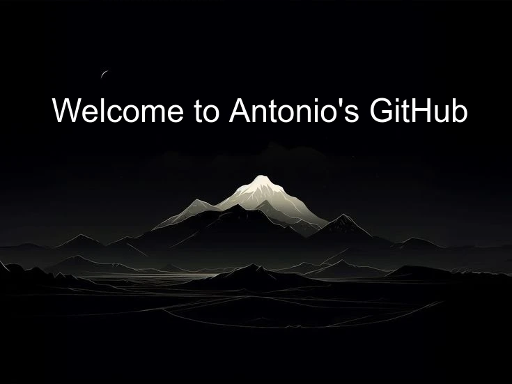

<h1 align="center">Hi there 👋</h1>

    <b>I'm Antonio</b> — IT student based in Madagascar. I build full-stack web apps and I'm exploring AI/ML, specially LLMs and how to make apps smarter. Passionate about building, experimenting, and bringing new ideas to life.

---

<h2 align="center">🛠️ My Craft & Toolbox</h1>

    

    

    

---

<h2 align="center">👀 Views</h2>

    

<h2 align="center">📊 Statistics</h2>

---

  ☕ Built with code & coffee · Shipping real things ✨ · Currently coding from Madagascar 🇲🇬

